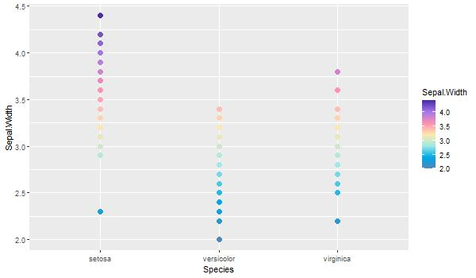
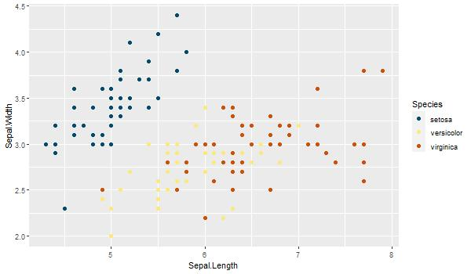
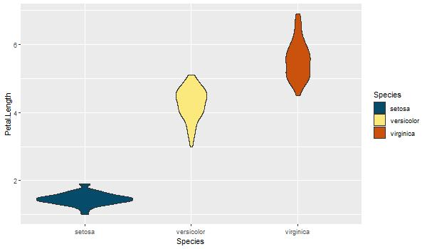

# naturalette
`naturalette` package offers a variety of color palettes based on the colors of some of the world's most iconic natural spaces and parks. This package offers a set of functions available as `ggplot2` scales:

-`scale_color_nature()`

-`scale_fill_nature()`


> La bellesa es la responsable de la veritat; i com que l'art és bellesa, sense veritat no hi ha art.
>
> --- Antoni Gaudí


***
[Installation](#install-package)  
[Palettes](#palettes)  
[Functions](#functions) 

## Install Package
Currently, the package is only able to be downloaded through github

```{r}
install.packages("devtools") 
devtools::install_github("AlbertMorera/naturalette") 
```

## Palettes

### Yellowstone
This palette is inspired by the colors of the hot spring of the Yellostone National Park (such as [Grand Prismatic Spring](https://en.wikipedia.org/wiki/Grand_Prismatic_Spring). 
```{r}
print_palette("Yellowstone")
```


```{r}
print_palette("Banff")
```


```{r}
print_palette("Flowers")
```


```{r}
print_palette("Sequoia")
```


```{r}
print_palette("Iceland")
```


## Functions

```{r}
ggplot(data=iris, aes(x=Species, y=Sepal.Width, color=Sepal.Width)) +
  geom_point(size=3) +
  scale_color_nature(palette = "Flowers", discrete=F)
```


```{r}
ggplot(data=iris, aes(x=Sepal.Length, y=Sepal.Width, color=Species)) +
  geom_point(size=2) +
  scale_color_nature(palette = "Yellowstone")
```


```{r}
ggplot(data=iris, aes(x=Species, y=Petal.Length, fill=Species)) +
  geom_violin() +
  scale_fill_nature(palette = "Antartica2")
```



## Contrinute

If you want to contribute to the design of new color palettes based on natural areas and natural parks, you can suggest a new color combination via a pull request

1. Fork the repository into your GitHub account.
2. Clone the forked repository to local machine, make the changes.
3. Commit and push the changes to GitHub. Create a pull request.

