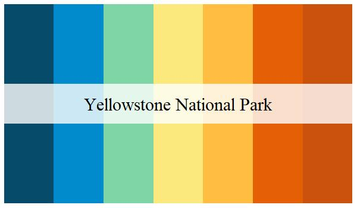
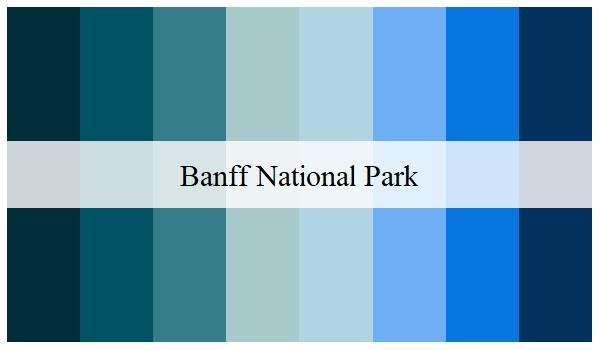
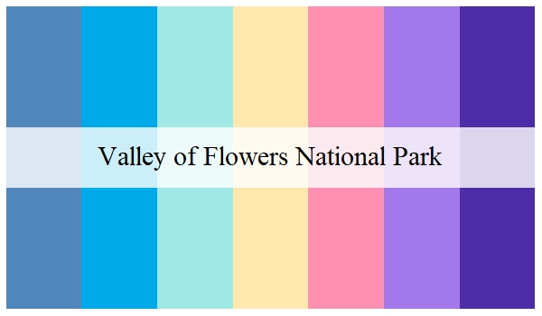
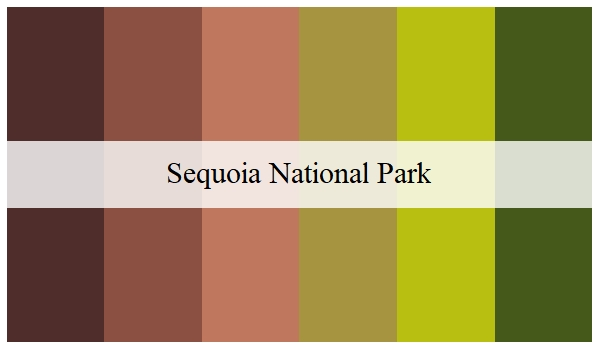
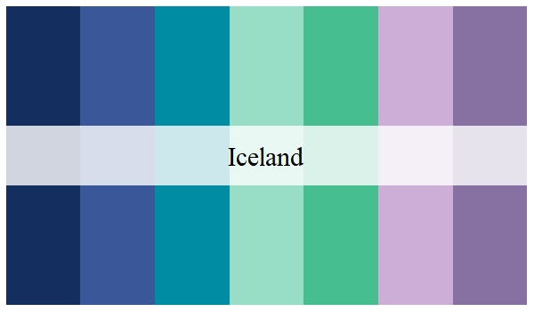

# naturalette
The naturalette package offers color palettes based on the colors of some of the world's most iconic natural spaces and parks.

[naturalette] offers a set of functions available for use in ggplot2


***
[Installation](#install-package)  
[Palettes](#palettes)  
[Functions](#functions) 

## Install Package
Currently, the package is only able to be downloaded through github

```{r}
install.packages("devtools") 
devtools::install_github("AlbertMorera/naturalette") 
```

## Palettes
```{r}
print_palette("Yellowstone")
```


```{r}
print_palette("Banff")
```


```{r}
print_palette("Flowers")
```


```{r}
print_palette("Sequoia")
```


```{r}
print_palette("Iceland")
```



## Functions

```{r}
ggplot(data=iris, aes(x=Species, y=Sepal.Width, color=Sepal.Width)) +
  geom_point(size=3) +
  scale_color_nature(palette = "Flowers", discrete=F)
```


```{r}
ggplot(data=iris, aes(x=Sepal.Length, y=Sepal.Width, color=Species)) +
  geom_point(size=2) +
  scale_color_nature(palette = "Yellowstone")
```


```{r}
ggplot(data=iris, aes(x=Species, y=Petal.Length, fill=Species)) +
  geom_violin() +
  scale_fill_nature(palette = "Antartica2")
```

